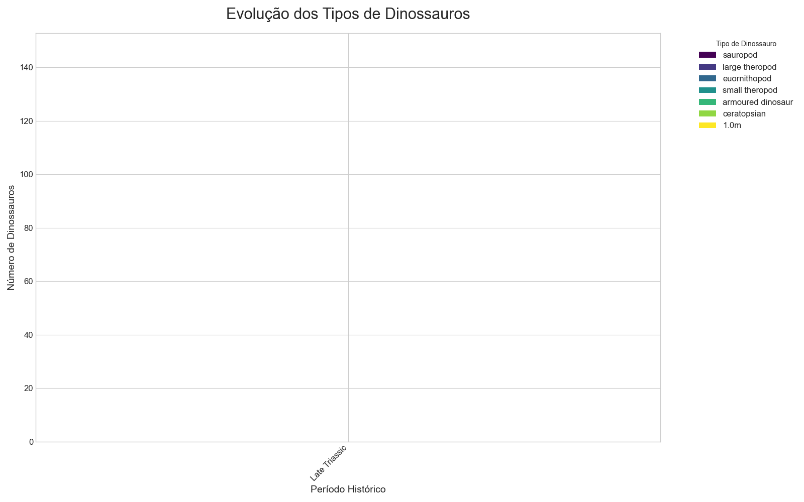
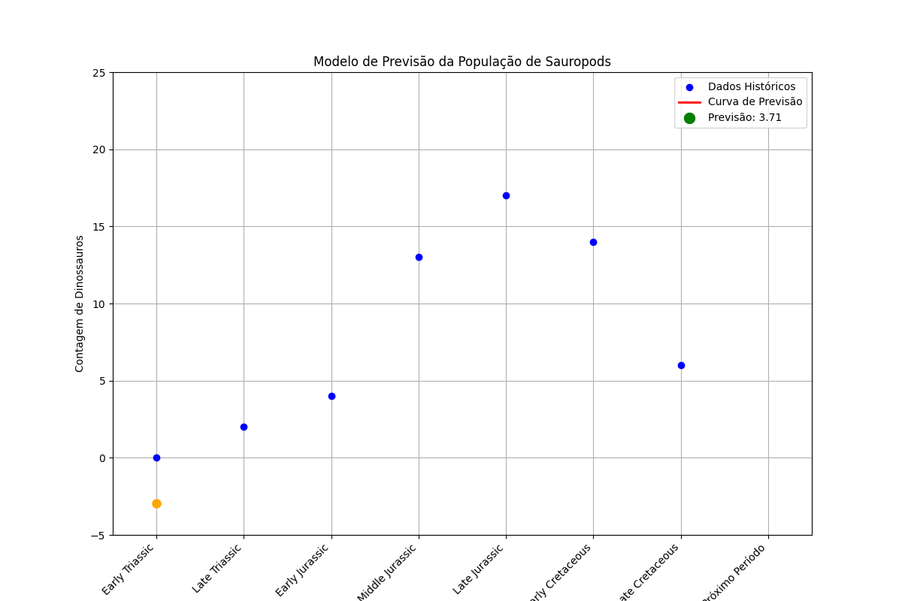

# Projeto de Previsão da População de Dinossauros

## Descrição do Projeto
Este projeto utiliza a regressão polinomial, uma técnica de machine learning, para modelar e prever a população de sauropods (dinossauros pescoçudos) com base em dados históricos. O objetivo é demonstrar como a análise de dados pode ser usada para prever a tendência de uma população ao longo do tempo.

## Funcionalidades
* **Análise de Dados Históricos:** Usa um conjunto de dados sobre dinossauros para extrair informações da população de sauropods em diferentes períodos geológicos.
* **Regressão Polinomial:** Treina um modelo de machine learning para encontrar a curva de melhor ajuste para os dados da população.
* **Previsão de População:** Prevê a população de sauropods em um período futuro.
* **Visualização Animada:** Gera uma animação que mostra a curva de previsão sendo traçada gradualmente, como uma "estrela cadente", e termina com um gráfico completo com anotações explicativas.

## Tecnologias Utilizadas
* **Python**
* **pandas:** Para manipulação e análise de dados.
* **scikit-learn:** Para o modelo de regressão polinomial.
* **numpy:** Para cálculos numéricos.
* **seaborn:** Para a criação dos gráficos estáticos e animados.


1.  **Clone o repositório:**
    ```bash
    git clone [https://github.com/lucasgrezzi/dinossaurs_prediction_proj]
    ```
2.  **Instale as bibliotecas necessárias:**
    ```bash
    pip install pandas scikit-learn seaborn numpy
    ```
3.  **Execute o script Python:**
    ```bash
    python ml2.py
    ```

## Resultados



Este GIF mostra a evolução de vários tipos de dinossauros ao longo do tempo.

Este gráfico visualiza a dinâmica de múltiplos grupos. Cada **linha colorida** representa uma espécie ou família diferente (como sauropods, large theropods, etc.), conforme a legenda.

A animação mostra como a população de cada um desses grupos aumentou, diminuiu e mudou de forma independente em diferentes **períodos históricos**. O GIF nos permite comparar a ascensão e queda de cada espécie, revelando como elas coexistiram e evoluíram ao longo do tempo.

---

### Animação da Previsão



Este GIF mostra o resultado do nosso projeto de previsão da população de dinossauros sauropods.

Inicialmente, vemos os pontos azuis, que representam a contagem de dinossauros em diferentes períodos do passado (são os nossos "Dados Históricos").

Em seguida, uma linha vermelha surge, como uma "estrela cadente". Essa linha é a Curva de Previsão gerada pelo nosso modelo de machine learning. Ela tenta encontrar o melhor caminho que se ajusta aos pontos azuis, mostrando a tendência geral da população ao longo do tempo.

Finalmente, um ponto verde aparece no final da curva. Esse ponto representa a nossa Previsão para a população de sauropods no próximo período. O número ao lado do ponto verde (3.71, no exemplo) indica a quantidade prevista de dinossauros.

Em resumo, o GIF ilustra como usamos dados históricos para treinar um modelo que nos permite prever o que pode acontecer com a população de dinossauros no futuro.
---
Feito por: Lucas Grezzi Baptista


